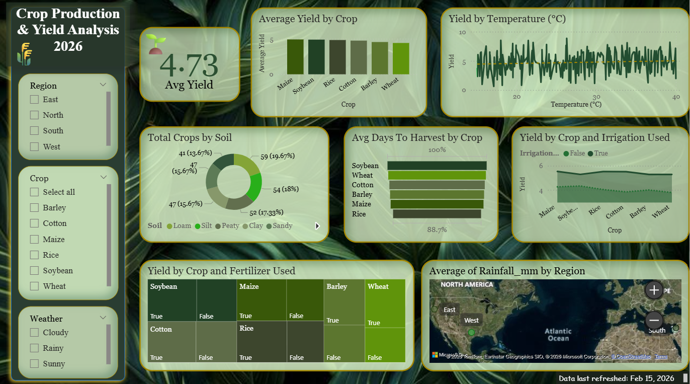

# 🌾 Crop Production & Yield Analysis | Power BI

## Project Overview

An interactive Power BI dashboard designed to analyze crop production and yield patterns across different crops, regions, soil types, weather conditions, irrigation methods, fertilizer usage, temperature, and rainfall.

## Dashboard Features

- Average Yield by Crop
- Yield by Temperature
- Total Crops by Soil Type
- Average Days to Harvest by Crop
- Yield by Crop and Irrigation
- Yield by Crop and Fertilizer Usage
- Average Rainfall by Region
- Interactive filters for Region, Crop, and Weather

## Tools & Technologies

- Power BI
- DAX
- Data Analysis
- Data Visualization
- Dashboard Development
- Data Storytelling

## Key Metric

**Average Yield: 4.73**

## Dashboard Preview

